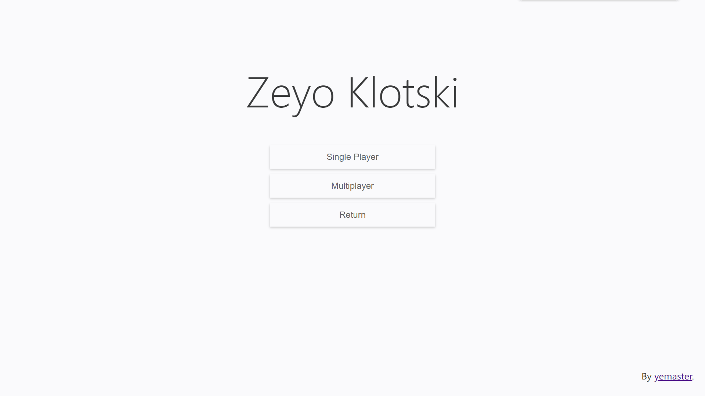
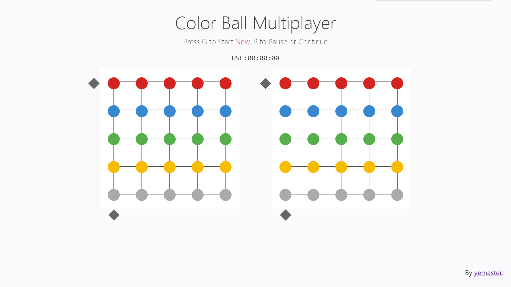
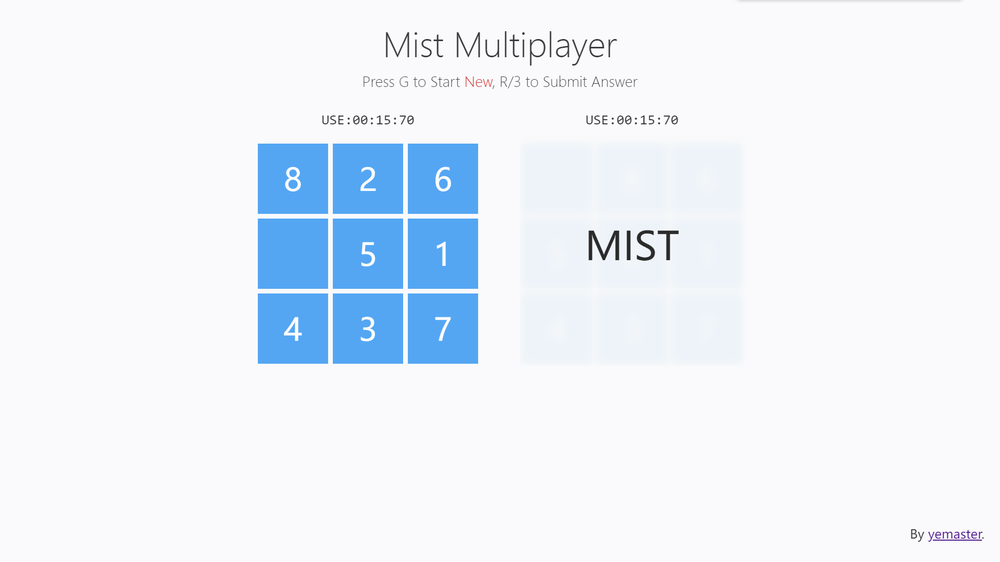
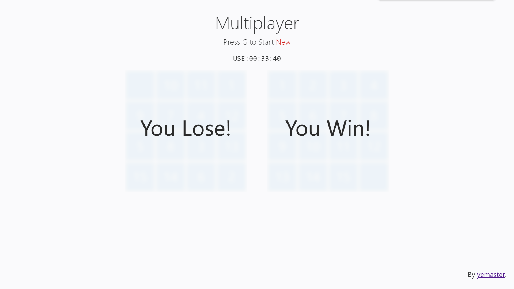

### Zeyo Klotski

JavaScript编写的数字华容道游戏，最初用来在数竞课划水，在数竞教室电脑编写，代码可能不太好看.

#### 0. 游戏截图

#### 1. 玩法

游戏分单人和双人，均在同一电脑上游玩. 首先双击点开`index.html`即可，然后根据提示操作. 点击start开始游戏，然后选择Single Player(单人)或者Multiplayer(多人)，接着选择游戏模式，内置多种游戏模式：

| 游戏模式   | 单人 | 多人 |
| ---------- | ---- | ---- |
| 经典       | √    | √    |
| Mist       | √    | √    |
| Chaos      | ×    | √    |
| Color Ball | √    | √    |

下面介绍各模式的操作，双人分为左玩家和右玩家，单人时两个键位均可操作. 选择模式后按G开始.

##### 1.1 经典

按键：G 开始/重来，WASD 左玩家，方向上下左右 右玩家

规则：将空格旁边的数与空格进行交换，从上到下从左到右排成1~15时胜利.

##### 1.2 Mist

按键：G 开始/重来，WASD 左玩家，R 左玩家提交答案，方向上下左右 右玩家，数字3 右玩家提交答案

规则：记忆初始盘面，进行1次操作后将无法看见盘面，认为成功后提交答案，正确则胜利，错误则罚时5秒并重新开始.

##### 1.3 Chaos

按键：G 开始/重来，WASD 左玩家，E 左玩家开始答题，R 左玩家放弃，方向上下左右 右玩家，数字2 右玩家开始答题，数字3 右玩家放弃

规则：记忆最终盘面，然后开始答题，将打乱后的盘面恢复成记忆好的最终盘面即胜利，如记忆失败则放弃，罚时5秒后回答新题目

##### 1.4 Color Ball

按键：G 开始/重来，WASD 左玩家控制行列，IJKL 左玩家，方向上下左右 右玩家控制行列，数字5123 右玩家

规则：通过按键可以让选定的行和列进行上下左右循环移动，恢复成5行同色即成功